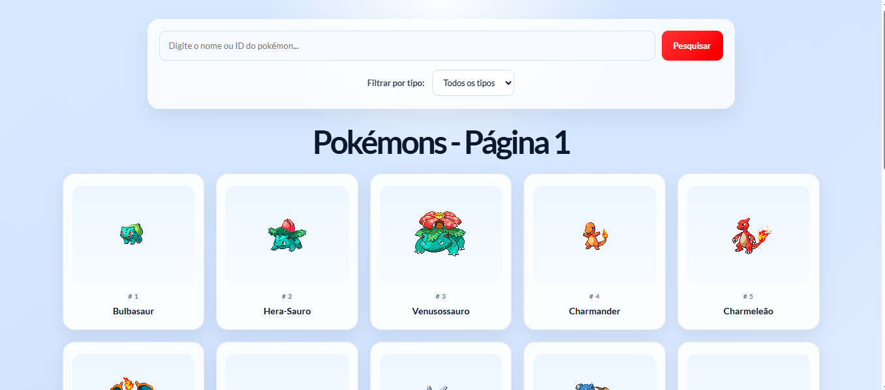
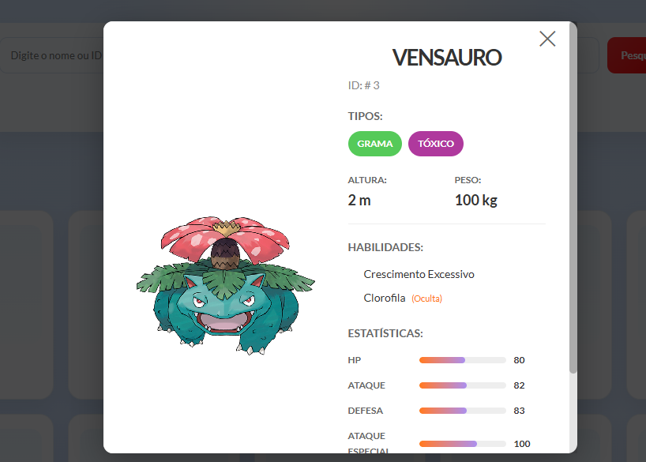

# Pokedex-React-JS
* Projeto acadêmico da disciplina de Programação Web 2 que teve como objetivo desenvolver uma Pokedéx usando React JS, para mostrar a funcionalidade de um framework front-end consumindo uma API.
* A API utilizada foi a mesma do projeto de pokedéx de HTML, CSS e JS, que pode ser acessada aqui:
> [PokeAPI](https://pokeapi.co/)


**Como rodar**

- Instale dependências:

```
npm install
```

- Inicie o servidor de desenvolvimento:

```
npm run dev
```


# Sobre a aplicação
* A aplicação oferece funcionalidades como filtrar por tipo, buscar pokémons, paginação renderizada em tempo real graças a funcionalidade de hooks do React e exibição de informação de cada pokémon.
* Segue exemplos de imagens de demonstração da aplicação:
  
Página inicial:




  Exibindo informações de um pokémon:
  
